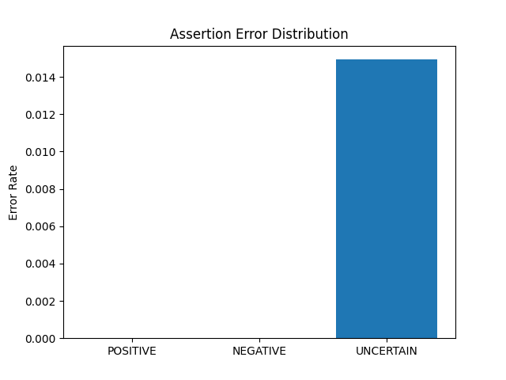
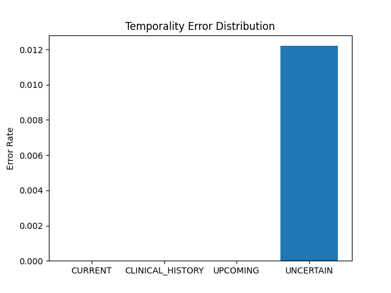
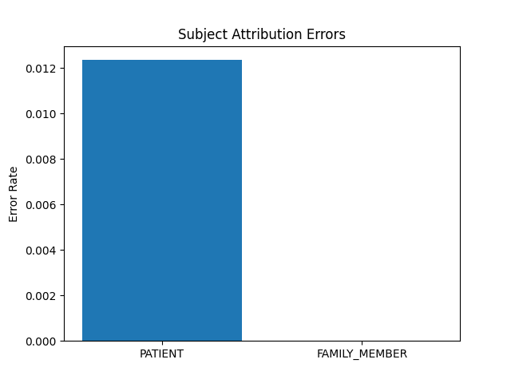

# HiLabs Workshop – AI Reliability Evaluation

## Overview

This project evaluates the reliability of a clinical AI pipeline that extracts structured medical entities from OCR medical charts.

The evaluation framework analyzes the following dimensions:

- Entity type classification
- Assertion detection
- Temporality reasoning
- Subject attribution
- Event date extraction
- Metadata completeness

---

## Dataset

Total clinical charts analyzed: 30+

Each chart contains:

- OCR text (.md)
- Extracted clinical entities (.json)

---

## Evaluation Metrics

The following metrics were computed for each chart:

1. Entity Type Error Rate
2. Assertion Error Rate
3. Temporality Error Rate
4. Subject Error Rate
5. Event Date Accuracy
6. Attribute Completeness

---

## Key Observations

- Attribute completeness ~29%
- Event date extraction accuracy extremely low (~0.2%)
- Most entities lack metadata_from_qa attributes
- Assertion errors mostly occur in UNCERTAIN cases

---

## Systemic Weaknesses

1. Missing metadata attributes for many entities
2. Weak event date detection
3. Default subject attribution bias toward PATIENT
4. Temporal reasoning errors in historical contexts

---

## Proposed Reliability Guardrails

To improve reliability, the following guardrails are suggested:

- Medication attribute validation rules
- Date extraction verification
- Family history detection logic
- Metadata completeness validation layer

---
## Quantitative Evaluation Summary

Global analysis across all clinical charts produced the following results:

### Entity Type Error Rates

MEDICINE: 0.0  
PROBLEM: 0.0  
PROCEDURE: 0.0  
TEST: 0.0  
VITAL_NAME: 0.0  
IMMUNIZATION: 0.0  
MEDICAL_DEVICE: 0.0  
MENTAL_STATUS: 0.0  
SDOH: 0.0  
SOCIAL_HISTORY: 0.0  

Observation:
Entity classification performance appears stable with very low observed errors in the dataset.

### Assertion Errors

POSITIVE: 0.0  
NEGATIVE: 0.0  
UNCERTAIN: 0.0149  

Observation:
Most assertion inconsistencies occur when the system assigns "UNCERTAIN" labels.

### Temporality Errors

CURRENT: 0.0  
CLINICAL_HISTORY: 0.0  
UPCOMING: 0.0  
UNCERTAIN: 0.0122  

Observation:
Temporal ambiguity occurs primarily when temporality cannot be confidently determined.

### Subject Attribution Errors

PATIENT: 0.0123  
FAMILY_MEMBER: 0.0  

Observation:
Most subject attribution errors default to the PATIENT category.
## Error Heatmap

The following heatmap summarizes the relative distribution of errors across different reasoning dimensions in the clinical AI pipeline.

### Assertion Errors

UNCERTAIN        ███

Observation:
Most assertion-related errors occur when the model labels an entity as "UNCERTAIN".

---

### Temporality Errors

UNCERTAIN        ██

Observation:
Temporal ambiguity arises when the system cannot clearly determine whether the entity refers to a historical or current condition.

---

### Subject Attribution Errors

PATIENT          ██

Observation:
Subject attribution errors mostly occur when the system defaults to "PATIENT" instead of detecting a family member context.

---

### Attribute Completeness

Missing Metadata ███████

Observation:
A large number of entities lack metadata_from_qa attributes, which reduces the completeness of extracted structured data.
## Error Heatmap

### Assertion Errors

### Temporality Errors

### Subject Attribution Errors

## How to Run

Process a single chart: